# ERD - StudyFlow Database

Tài liệu này mô tả thiết kế quan hệ dữ liệu tổng thể cho hệ thống **Quản lý và lập kế hoạch học tập cho sinh viên**. Đây là bản thiết kế ERD, chưa phải migration hoặc Prisma schema.

## Tổng Quan Quan Hệ

- `User` là trung tâm dữ liệu cá nhân. Mỗi user sở hữu học kỳ, môn học, kế hoạch, nhiệm vụ, lịch, mục tiêu, điểm học tập, tài liệu, ghi chú, thông báo và log hoạt động.
- `Role` liên kết nhiều-nhiều với `User` qua `UserRole`, phục vụ phân quyền `student`, `admin` và các vai trò mở rộng sau này.
- `Semester` thuộc một `User`; `Subject` thuộc một `Semester` và nên lưu thêm `userId` để truy vấn nhanh theo chủ sở hữu.
- `StudyPlan` có thể gắn với một `Subject`; `Task` có thể gắn với một `StudyPlan`, một `Subject`, hoặc chỉ thuộc user như task cá nhân.
- `Task` có nhiều `SubTask` và `TaskAttachment`.
- `Schedule` là lịch lặp hoặc lịch học theo tuần; `Event` là sự kiện đơn có thời điểm cụ thể.
- `GradeComponent` định nghĩa cột điểm của một môn; `Grade` lưu điểm thực tế của từng component.
- `StudySession` ghi nhận phiên học; `PomodoroSession` là các phiên con thuộc một phiên học.
- `Document` và `Note` có thể gắn với `Subject`, `Task`, hoặc chỉ thuộc user.
- `Notification` thuộc user và có thể liên kết mềm đến entity liên quan bằng `relatedEntityType` + `relatedEntityId`.
- `StudyGroup` có nhiều thành viên qua `GroupMember` và nhiều nhiệm vụ nhóm qua `GroupTask`.
- `ActivityLog` có thể thuộc một user hoặc là log hệ thống nếu `userId` nullable.

## Mermaid ERD

```mermaid
erDiagram
    USERS {
        uuid id PK
        string full_name
        string email UK
        string student_code UK "nullable"
        string password_hash
        string avatar_url "nullable"
        string school "nullable"
        string major "nullable"
        int course_year "nullable"
        string timezone
        string language
        string theme_mode
        boolean is_email_verified
        int failed_login_count
        datetime locked_until "nullable"
        datetime deleted_at "nullable"
        datetime created_at
        datetime updated_at
    }

    ROLES {
        uuid id PK
        string name UK
        string description "nullable"
        datetime created_at
        datetime updated_at
    }

    USER_ROLES {
        uuid user_id FK
        uuid role_id FK
        datetime assigned_at
    }

    REFRESH_TOKENS {
        uuid id PK
        uuid user_id FK
        string token_hash UK
        datetime expires_at
        datetime revoked_at "nullable"
        datetime created_at
    }

    SEMESTERS {
        uuid id PK
        uuid user_id FK
        string name
        string academic_year
        date start_date
        date end_date
        string status
        decimal target_gpa "nullable"
        int expected_credits "nullable"
        text note "nullable"
        datetime deleted_at "nullable"
        datetime created_at
        datetime updated_at
    }

    SUBJECTS {
        uuid id PK
        uuid semester_id FK
        uuid user_id FK
        string code
        string name
        int credits
        string lecturer "nullable"
        string room "nullable"
        string color_hex
        decimal target_grade "nullable"
        string status
        text note "nullable"
        datetime deleted_at "nullable"
        datetime created_at
        datetime updated_at
    }

    STUDY_PLANS {
        uuid id PK
        uuid user_id FK
        uuid subject_id FK "nullable"
        string title
        text description "nullable"
        date start_date "nullable"
        date end_date "nullable"
        string target_goal "nullable"
        decimal estimated_hours "nullable"
        string priority
        string status
        int progress_percent
        datetime deleted_at "nullable"
        datetime created_at
        datetime updated_at
    }

    TASKS {
        uuid id PK
        uuid user_id FK
        uuid study_plan_id FK "nullable"
        uuid subject_id FK "nullable"
        string title
        text description "nullable"
        date start_date "nullable"
        datetime due_date "nullable"
        int estimated_minutes "nullable"
        int difficulty "nullable"
        string priority
        string status
        int sort_order
        datetime completed_at "nullable"
        datetime deleted_at "nullable"
        datetime created_at
        datetime updated_at
    }

    SUB_TASKS {
        uuid id PK
        uuid task_id FK
        string title
        boolean is_done
        int sort_order
        datetime created_at
        datetime updated_at
    }

    TASK_ATTACHMENTS {
        uuid id PK
        uuid task_id FK
        string file_url
        string file_name
        string file_type "nullable"
        int size_bytes "nullable"
        datetime created_at
    }

    GOALS {
        uuid id PK
        uuid user_id FK
        uuid subject_id FK "nullable"
        string name
        string type
        decimal target_value
        decimal current_value
        date deadline "nullable"
        string status
        datetime created_at
        datetime updated_at
    }

    SCHEDULES {
        uuid id PK
        uuid user_id FK
        uuid subject_id FK "nullable"
        string type
        string title
        int day_of_week "nullable"
        string start_time
        string end_time
        date start_date
        date end_date "nullable"
        string recurrence_rule
        string color_hex "nullable"
        int reminder_before "nullable"
        datetime deleted_at "nullable"
        datetime created_at
        datetime updated_at
    }

    EVENTS {
        uuid id PK
        uuid user_id FK
        string title
        text description "nullable"
        datetime start_at
        datetime end_at "nullable"
        boolean is_all_day
        string color_hex "nullable"
        int reminder_before "nullable"
        datetime deleted_at "nullable"
        datetime created_at
        datetime updated_at
    }

    GRADE_COMPONENTS {
        uuid id PK
        uuid subject_id FK
        string name
        decimal max_score
        decimal weight_percent
        date exam_date "nullable"
        text note "nullable"
        int sort_order
        datetime created_at
        datetime updated_at
    }

    GRADES {
        uuid id PK
        uuid grade_component_id FK
        decimal score "nullable"
        datetime graded_at "nullable"
        datetime created_at
        datetime updated_at
    }

    STUDY_SESSIONS {
        uuid id PK
        uuid user_id FK
        uuid subject_id FK "nullable"
        datetime started_at
        datetime ended_at "nullable"
        int total_minutes
        text note "nullable"
        datetime created_at
        datetime updated_at
    }

    POMODORO_SESSIONS {
        uuid id PK
        uuid study_session_id FK
        string session_type
        int planned_minutes
        int actual_minutes "nullable"
        datetime started_at
        datetime ended_at "nullable"
        boolean is_completed
    }

    DOCUMENTS {
        uuid id PK
        uuid user_id FK
        uuid subject_id FK "nullable"
        uuid task_id FK "nullable"
        string title
        string file_url
        string file_type
        string storage_provider
        int size_bytes "nullable"
        string tags
        datetime deleted_at "nullable"
        datetime created_at
        datetime updated_at
    }

    NOTES {
        uuid id PK
        uuid user_id FK
        uuid subject_id FK "nullable"
        uuid task_id FK "nullable"
        string title
        text content_rich_text
        boolean is_pinned
        string tags
        datetime deleted_at "nullable"
        datetime created_at
        datetime updated_at
    }

    NOTIFICATIONS {
        uuid id PK
        uuid user_id FK
        string type
        string title
        text message
        string related_entity_type "nullable"
        uuid related_entity_id "nullable"
        boolean is_read
        string channel
        datetime sent_at "nullable"
        datetime created_at
    }

    NOTIFICATION_SETTINGS {
        uuid id PK
        uuid user_id FK
        int reminder_minutes_before
        boolean email_enabled
        boolean push_enabled
        boolean in_app_enabled
        datetime created_at
        datetime updated_at
    }

    FLASHCARD_SETS {
        uuid id PK
        uuid user_id FK
        uuid subject_id FK "nullable"
        string name
        text description "nullable"
        datetime created_at
        datetime updated_at
    }

    FLASHCARDS {
        uuid id PK
        uuid flashcard_set_id FK
        text question
        text answer
        boolean is_difficult
        int correct_count
        int wrong_count
        datetime next_review_at "nullable"
        datetime created_at
        datetime updated_at
    }

    STUDY_GROUPS {
        uuid id PK
        uuid owner_id FK
        string name
        text description "nullable"
        datetime created_at
        datetime updated_at
    }

    GROUP_MEMBERS {
        uuid id PK
        uuid study_group_id FK
        uuid user_id FK
        string role
        string status
        datetime joined_at "nullable"
    }

    GROUP_TASKS {
        uuid id PK
        uuid study_group_id FK
        uuid assigned_user_id FK "nullable"
        string title
        text description "nullable"
        datetime due_date "nullable"
        string status
        datetime created_at
        datetime updated_at
    }

    FEEDBACKS {
        uuid id PK
        uuid user_id FK
        string type
        string title
        text content
        string status
        text admin_reply "nullable"
        datetime created_at
        datetime resolved_at "nullable"
    }

    ACTIVITY_LOGS {
        uuid id PK
        uuid user_id FK "nullable"
        string action
        string entity_type "nullable"
        uuid entity_id "nullable"
        string ip_address "nullable"
        string user_agent "nullable"
        json metadata "nullable"
        datetime created_at
    }

    USERS ||--o{ USER_ROLES : has
    ROLES ||--o{ USER_ROLES : assigned_to
    USERS ||--o{ REFRESH_TOKENS : owns

    USERS ||--o{ SEMESTERS : owns
    SEMESTERS ||--o{ SUBJECTS : contains
    USERS ||--o{ SUBJECTS : owns

    USERS ||--o{ STUDY_PLANS : owns
    SUBJECTS ||--o{ STUDY_PLANS : plans_for
    STUDY_PLANS ||--o{ TASKS : contains
    USERS ||--o{ TASKS : owns
    SUBJECTS ||--o{ TASKS : tasks_for
    TASKS ||--o{ SUB_TASKS : contains
    TASKS ||--o{ TASK_ATTACHMENTS : has

    USERS ||--o{ GOALS : owns
    SUBJECTS ||--o{ GOALS : targets
    USERS ||--o{ SCHEDULES : owns
    SUBJECTS ||--o{ SCHEDULES : schedules
    USERS ||--o{ EVENTS : owns

    SUBJECTS ||--o{ GRADE_COMPONENTS : has
    GRADE_COMPONENTS ||--o| GRADES : receives

    USERS ||--o{ STUDY_SESSIONS : studies
    SUBJECTS ||--o{ STUDY_SESSIONS : tracked_for
    STUDY_SESSIONS ||--o{ POMODORO_SESSIONS : contains

    USERS ||--o{ DOCUMENTS : owns
    SUBJECTS ||--o{ DOCUMENTS : stores
    TASKS ||--o{ DOCUMENTS : attaches
    USERS ||--o{ NOTES : owns
    SUBJECTS ||--o{ NOTES : stores
    TASKS ||--o{ NOTES : references

    USERS ||--o{ NOTIFICATIONS : receives
    USERS ||--o| NOTIFICATION_SETTINGS : configures

    USERS ||--o{ FLASHCARD_SETS : owns
    SUBJECTS ||--o{ FLASHCARD_SETS : groups
    FLASHCARD_SETS ||--o{ FLASHCARDS : contains

    USERS ||--o{ STUDY_GROUPS : owns
    STUDY_GROUPS ||--o{ GROUP_MEMBERS : has
    USERS ||--o{ GROUP_MEMBERS : joins
    STUDY_GROUPS ||--o{ GROUP_TASKS : contains
    USERS ||--o{ GROUP_TASKS : assigned

    USERS ||--o{ FEEDBACKS : sends
    USERS ||--o{ ACTIVITY_LOGS : triggers
```

## Nullable, Cascade Và Soft Delete

### Nullable

- `User.studentCode`, `avatarUrl`, `school`, `major`, `courseYear`, `lockedUntil`, `deletedAt` nullable để hỗ trợ user chưa hoàn thiện hồ sơ hoặc đã xóa mềm.
- `Subject` nên có `semesterId` bắt buộc, nhưng lưu thêm `userId` để truy vấn nhanh và kiểm tra ownership.
- `StudyPlan.subjectId` nullable để user tạo kế hoạch học chung không gắn môn.
- `Task.studyPlanId` và `Task.subjectId` nullable để hỗ trợ task cá nhân.
- `Goal.subjectId` nullable để hỗ trợ mục tiêu tổng quát như GPA toàn học kỳ hoặc số giờ học.
- `Schedule.subjectId` nullable cho lịch cá nhân.
- `StudySession.subjectId` nullable nếu user học tự do.
- `Document.subjectId`, `Document.taskId`, `Note.subjectId`, `Note.taskId` nullable để tài liệu/ghi chú có thể là thư viện cá nhân.
- `GroupTask.assignedUserId` nullable nếu task nhóm chưa phân công.
- `ActivityLog.userId` nullable nếu log do hệ thống hoặc cron job tạo.
- `Notification.relatedEntityType` và `relatedEntityId` nullable cho thông báo hệ thống không gắn entity cụ thể.

### Cascade

- Xóa cứng `User` nên cascade đến `UserRole`, `RefreshToken`, `NotificationSetting` và các dữ liệu bảo mật phụ thuộc trực tiếp.
- `Semester -> Subject`, `Subject -> StudyPlan/Task/GradeComponent/Schedule/StudySession/Document/Note` nên thận trọng. Với dữ liệu học tập, ưu tiên soft delete ở application layer thay vì cascade xóa cứng.
- `Task -> SubTask` và `Task -> TaskAttachment` có thể cascade vì đây là dữ liệu phụ thuộc trực tiếp vào task.
- `GradeComponent -> Grade` có thể cascade vì grade không có ý nghĩa nếu component bị xóa.
- `StudySession -> PomodoroSession` có thể cascade vì pomodoro là chi tiết của phiên học.
- `FlashcardSet -> Flashcard` có thể cascade.
- `StudyGroup -> GroupMember/GroupTask` có thể cascade nếu xóa nhóm thật; production nên cân nhắc archive nhóm.

### Soft Delete

Nên dùng `deletedAt` cho các entity nghiệp vụ chính:

- `User`
- `Semester`
- `Subject`
- `StudyPlan`
- `Task`
- `Schedule`
- `Event`
- `Document`
- `Note`

Lý do:
- Tránh mất dữ liệu học tập quan trọng.
- Cho phép khôi phục nhầm lẫn.
- Giữ thống kê lịch sử chính xác.
- Giảm rủi ro khi user hoặc admin thao tác nhầm.

Các entity có thể xóa cứng:

- `RefreshToken` hết hạn hoặc đã revoke lâu ngày.
- `SubTask`, `TaskAttachment` nếu task bị xóa cứng.
- `PomodoroSession` nếu study session bị xóa cứng.
- `Notification` cũ sau thời gian retention.

## Gợi Ý Index

### Auth Và Ownership

- `users(email)` unique.
- `users(student_code)` unique, nullable.
- `users(deleted_at)`.
- `roles(name)` unique.
- `user_roles(user_id, role_id)` unique.
- `refresh_tokens(user_id, expires_at)`.
- `refresh_tokens(token_hash)` unique.

### Dashboard

- `semesters(user_id, status, deleted_at)`.
- `subjects(user_id, status, deleted_at)`.
- `tasks(user_id, status, due_date, deleted_at)`.
- `tasks(user_id, completed_at)`.
- `study_sessions(user_id, started_at)`.
- `goals(user_id, status, deadline)`.
- `notifications(user_id, is_read, created_at)`.

Mục tiêu: lấy nhanh task hôm nay, task quá hạn, môn đang học, mục tiêu active, thông báo chưa đọc và thời gian học trong tuần.

### Calendar

- `schedules(user_id, start_date, end_date, recurrence_rule, deleted_at)`.
- `schedules(user_id, day_of_week, start_time)`.
- `events(user_id, start_at, end_at, deleted_at)`.
- `tasks(user_id, due_date, status, deleted_at)`.
- `grade_components(subject_id, exam_date)`.

Mục tiêu: gom lịch học lặp, sự kiện đơn, deadline task và ngày thi trong một khoảng ngày.

### Kanban Và Task List

- `tasks(user_id, status, sort_order, deleted_at)`.
- `tasks(user_id, subject_id, status, sort_order)`.
- `tasks(study_plan_id, status, sort_order)`.
- `tasks(user_id, priority, due_date)`.
- `sub_tasks(task_id, sort_order)`.

Mục tiêu: tải board theo cột, kéo thả ổn định và lọc theo môn/priority.

### Grade Và GPA

- `subjects(semester_id, status, deleted_at)`.
- `grade_components(subject_id, sort_order)`.
- `grades(grade_component_id)` unique.

Mục tiêu: tính điểm môn và GPA học kỳ bằng ít query.

### Statistics

- `study_sessions(user_id, subject_id, started_at)`.
- `pomodoro_sessions(study_session_id, started_at)`.
- `tasks(user_id, subject_id, completed_at)`.
- `tasks(user_id, status, due_date)`.
- `goals(user_id, type, status)`.

Mục tiêu: thống kê thời gian học, tiến độ task, pomodoro hoàn thành, goal progress theo ngày/tuần/tháng.

### Documents Và Notes

- `documents(user_id, subject_id, deleted_at)`.
- `documents(user_id, task_id, deleted_at)`.
- `notes(user_id, is_pinned, updated_at, deleted_at)`.
- `notes(user_id, subject_id, updated_at)`.

Mục tiêu: mở thư viện tài liệu/ghi chú nhanh theo môn, task, tag và trạng thái ghim.

## Ghi Chú Thiết Kế

- `relatedEntityType` + `relatedEntityId` trong `Notification` là polymorphic reference mềm. Database không enforce FK được cho mọi loại entity, nên backend phải validate khi tạo notification.
- `Subject.userId` là dữ liệu dư có kiểm soát để tối ưu ownership query. Khi tạo subject, backend phải đảm bảo `subject.userId` trùng với `semester.userId`.
- Các trường progress như `StudyPlan.progressPercent` có thể lưu cache để hiển thị nhanh, nhưng backend phải tính lại sau khi task thay đổi.
- `Goal.progressPercent` không nên lưu nếu có thể tính từ dữ liệu hiện tại; chỉ lưu `targetValue` và `currentValue` khi loại mục tiêu cần nhập tay.
- Với PostgreSQL, các enum nên được định nghĩa nhất quán trong Prisma để tránh lỗi sai chuỗi trạng thái giữa backend và database.

